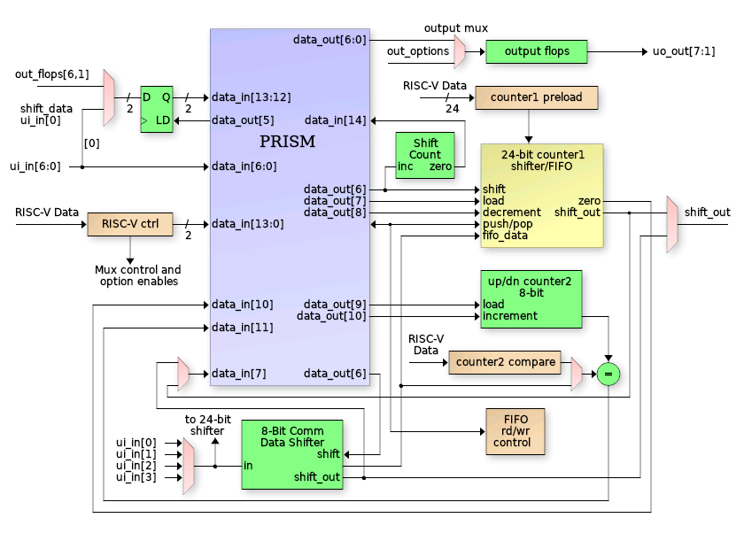

<!---

This file is used to generate your project datasheet. Please fill in the information below and delete any unused
sections.

You can also include images in this folder and reference them in the markdown. Each image must be less than
512 kb in size, and the combined size of all images must be less than 1 MB.
-->

## PRISM

Author: Ken Pettit

Peripheral index: 8

## What it does

This is a Programmable Reconfigurable Indexed State Machine (PRISM) that executes a Verilog coded Mealy state machine that is loaded via a configuration bitstream at runtime.

The PRISM controller itself is a programmable state machine that uses an N-bit (3 in this case)
index register to track the current FSM state.  That index is a pointer into the State Information Table (SIT) to request the State Execution Word (STEW).

## Operating priciples of PRISM

PRISM supports FSM designs up to 8 states and includes controllable peripherals such as counters, communication shift register, FIFO and interrupt support.  It also features an integrated debugger with 2 breakpoints, single-stepping and readback of state information.  Due to long combinatorial delays, PRISM operates from a divide-by-two clock (32Mhz max).  The following is a block diagram of the PRISM controller:

Each state is encoded with a 44-bit (in the case of TinyQV PRISM) execution word that controls the FSM output values, input values and state transition decision tree for that state.  The peripheral is operated by loading a "Chroma" (more on that below), or execution personality in the 352 bit configuration array and programming the 14-bit control word to set peripheral behaviors (like choosing 24-bit shift register vs. 24-bit counter, choosing pin locations for shift data in/out, etc.).

Once a chroma has been loaded, the control register programmed and the PRISM enabled, the FSM will start at state 0.  Eight of the bits in the State Execution Word (STEW) specify which of 16 inputs get routed to the 2-input Look Up Table (LUT) that makes the decision for jumping to the specified state (stored in 3 bits of the STEW).  While in any state, there is a set of 11 (from the STEW) output bits that drive the PRISM block outputs when the LUT output is zero (no jump) and 11 more that are output during a jump (transitional outputs).

Each state also has an independent 16-input mux (4-bits from STEW) driving a 1-input LUT to drive a "conditional output".  This is an output who's value is not strictly depedent on the static values in the STEW for the current state, but rather depends on the selected input during that state.

In larger PRISM implementations, each state has "dual-compare" with two N-bit LUTs which allows jumping to one of two possible states.  Due to size restrictions, this peripheral does not include dual-compare.  Instead the PRISM implementation has (in each state's STEW), a single "increment state" bit.  In any state where this bit is set and the LUT output is FALSE (i.e no jump), then the state will increment to the next state, and the "starting state" of the first occurance of this will be saved.  Then each successive state can test a different set of inputs to jump to different states.  When a state is encountered without the 'inc' bit set, PRISM will loop back to the "starting state" and loop through that set of states until the first TRUE from a LUT, clearing the loop.

TL/DR:
  1. Load a Chroma defining the FSM and enable PRISM
  2. State starts at zero
  3. Each state chooses up to 3 of 16 inputs via config bits
  4. 2-input LUT decides if "jump to defined state" occurs
  5. Increment bit decides if "state looping" is in effect
  6. State looping ends when first LUT jump occurs
  7. Outputs bits from STEW for "non-jump" and "transitional jump"
  8. One conditional output based on single selected input per state

## Peripherals

The PRISM Peripheral has, itself, peripherals.  Those are:
  1. 8-Bit communication shift register (left or right)
  2. 8-Bit count up/down register with compare (dedicated compare reg or comm register).
  3. 24-bit register: Count down with zero detect, shift left / right or 3-byte FIFO
  4. 5-bit Shift bit counter (automatic)
  5. Input shift data source selection
  6. Output shift data destination selection
  7. Conditional output destination selection
  8. Controllable latched inputs (2-bits)

## Chroma

Chroma are PRISM's version of "personalities".  Each chroma is a unique hue of PRISM's spectrum of behavior. Chroma's are coded as Mealy state machines in Verilog to define FSM inputs, outputs and state transitions:

   always @(posedge clk or negedge rst_n)
      if (~rst_n)
         curr_state <= 3'h0;
      else
         curr_state <= fsm_enable ? next_state : 'h0;

   always_comb
   begin
      pin_out[5:0]   = 6'h0;
      count1_dec     = 1'b0;
      etc.

      case (curr_state)
      STATE_IDLE:       // State 0
         begin
            // Detect I/O shift start 
            if (host_in[HOST_START])
            begin
               // Load inputs 
               pin_out[GPIO_LOAD] = 1'b0;

               // Load 24-bit shift register from preload (our OUTPUTS)
               count1_load = 1'b1;
               next_state = STATE_LATCH_INPUTS;
            end
         end
      STATE_LATCH_INPUTS:  // State 1
         begin
            next_state = STATE_SHIFT_BITS;
         end
      etc.
   end

Chroma are compiled into PRISM programmable bitstreams via a custom fork of Yosys (see link below) using a configuration file describing the architecture in the TinyQV PRISM peripheral.  In addition to bitstream generation, the Yosys PRISM backend also calculates the ctrl_reg value for selecting configuring the PRISM peripheral muxes, etc.  There are several output formats including C, Python and columnar list:

| ST | Mux0 | Mux1 | Mux2 | Inc | JmpA | OutA | Out | CfgA | CfgB |        STEW |
|----|------|------|------|-----|------|------|-----|------|------|-------------|
|  0 |    8 |    0 |    0 |   0 |    1 |  100 | 001 |    a |    0 | 28800012010 |
|  1 |    0 |    0 |    0 |   0 |    2 |  001 | 000 |    f |    0 | 3c008004000 |
|  2 |    d |    0 |    0 |   0 |    3 |  001 | 041 |    a |    0 | 2800841601a |
|  3 |    e |    0 |    0 |   1 |    2 |  001 | 001 |    5 |    0 | 1400801401d |
|  4 |    0 |    0 |    9 |   0 |    5 |  001 | 000 |    f |    2 | bc00800b200 |
|  5 |    8 |    0 |    0 |   0 |    0 |  001 | 001 |    5 |    0 | 14008010010 |
|  6 |    0 |    0 |    0 |   0 |    0 |  001 | 000 |    f |    0 | 3c008000000 |
|  7 |    0 |    0 |    0 |   0 |    0 |  001 | 000 |    f |    0 | 3c008000000 |

## Register map

Document the registers that are used to interact with your peripheral

| Address | Name          | Access | Description                                                         |
|---------|---------------|--------|---------------------------------------------------------------------|
| 0x00    | CTRL          | R/W    | Control register - see [CTRL Register](#ctrl-register-0x00) below   |
| 0x04    | DBG_CTRL      | W      | Debug control                                                       |
| 0x0C    | DBG_STAT      | W      | Debug status                                                        |
| 0x10    | CFG_LSB       | W      | Config LSB (write second)                                           |
| 0x14    | CFG_MSB       | W      | Config MSB (write first)                                            |
| 0x18    | HOST_DATA     | R/W    | Host data - see [HOST_DATA Register](#host_data-register-0x18)      |
| 0x19    | FIFO_DATA     | R      | FIFO read data - see [HOST_DATA Register](#host_data-register-0x18) |
| 0x1A    | FIFO_STAT     | R      | FIFO status - see [HOST_DATA Register](#host_data-register-0x18)    |
| 0x1B    | HOST_IN       | R/W    | Host input - see [HOST_DATA Register](#host_data-register-0x18)     |
| 0x20    | COUNT_CFG     | R/W    | Counter config - see [COUNT_CFG Reg](#count_config-register-0x20)   |
| 0x24    | COUNT_VAL     | R      | Counter values - see [COUNT_VAL Reg](#count_values-register-0x24)   |
| 0x34    | DECISION_TREE | R      | Decision tree data                                                  |
| 0x38    | OUTPUT_DATA   | R      | Output data                                                         |
| 0x3C    | INPUT_DATA    | R      | Input data                                                          |

### Bit-field Details

#### CTRL Register (0x00)

| Bit(s) | Name            | Description                       |
|--------|-----------------|-----------------------------------|
| 31     | Interrupt clear | Write 1 to clear interrupt        |
| 30     | PRISM enable    | Enable/disable PRISM executino    |
| 23     | ui_in[7]        | Direct read of ui_in bit 7        |
| 22-16  | latched_out     | Latched output values             |
| 13     | latch5          | Use prism_out[5] to latch inputs  |
| 12     | count2_dec      | Enable count2 decrement mode      |
| 11     | fifo_24         | Enable 24-bit FIFO mode           |
| 10     | shift_24_en     | Enable 24-bit shift mode          |
| 9      | shift_dir       | Shift direction (0=left, 1=right) |
| 8      | shift_en        | Enable shift operations           |
| 7      | latch_in_out    | Latch input/output mode           |
| 6-4    | cond_out_sel    | Conditional output selection      |
| 3-2    | shift_out_sel   | Shift output selection            |
| 1-0    | comm_in_sel     | Communication input selection     |

#### DBG_CTRL Register (0x04)

| Bit(s) | Name        | Description                      |
|--------|-------------|----------------------------------|
| 13-11  | new_si_val  | New state index to set           |
| 10     | new_si      | Set to 1 to set new state index  |
| 9-7    | bp1         | Breakpoint 1 state index         |
| 6-4    | bp0         | Breakpoint 0 state index         |
| 3      | bp1_en      | Enable breakpoint 1              |
| 2      | bp0_en      | Enable breakpoint 0              |
| 1      | single_step | Toggle 1->0 to single step PRISM |
| 0      | halt_req    | Set to 1 to halt the PRISM       |

#### DBG_STAT Register (0x0C)

| Bit(s) | Name         | Description                  |
|--------|--------------|------------------------------|
| 8-7    | break_active | Which breakpoint is active   |
| 6      | debug_halt   | Indicates if PRISM is halted |
| 5-3    | next_si      | Next state index to jump to  |
| 2-0    | curr_si      | Current state index          |

#### HOST_DATA Register (0x18)

| Bit(s) | Name         | Description        |
|--------|--------------|--------------------|
| 31-26  | Reserved     | Reserved bits      |
| 25-24  | host_in      | Host input data    |
| 23-21  | Reserved     | Reserved bits      |
| 20-19  | fifo_rd_ptr  | Reserved bits      |
| 19-18  | fifo_wr_ptr  | Reserved bits      |
| 17     | fifo_full    | FIFO full status   |
| 16     | fifo_empty   | FIFO empty status  |
| 15-8   | fifo_rd_data | FIFO read data     |
| 7-0    | comm_data    | Communication data |

#### FIFO_READ Register (0x19)

Byte-mode access of the 3-byte RX FIFO.  A byte read from this address will "pop" the byte from the fifo, incrementing the read point, updating the FULL / EMPTY flags, etc.

#### FIFO_STATUS Register (0x1a)

Byte-mode access of the RX FIFO status.

| Bit(s) | Name     | Description   |
|--------|----------|---------------|
| 31-26  | Reserved | Reserved bits |

#### COUNT_CONFIG Register (0x20)

| Bit(s) | Name           | Description          |
|--------|----------------|----------------------|
| 31-24  | count2_compare | 8-bit Compare value  |
| 23-0   | count1_preload | 24-bit Preload value |

#### COUNT_VALUES Register (0x24)

| Bit(s) | Name   | Description                     |
|--------|--------|---------------------------------|
| 31-24  | count2 | Current value of 8-bit counter  |
| 23-0   | count1 | Current value of 24-bit counter |

#### DEBUG_OUT Register (0x30)

| Bit(s) | Name         | Description       |
|--------|--------------|-------------------|
| 31-0   | debug_output | Debug output bits |

#### DECISION_TREE Debug Register (0x34)

| Bit(s) | Name          | Description                    |
|--------|---------------|--------------------------------|
| 31-0   | decision_tree | Compare matches and LUT inputs |

#### OUTPUT_DATA Debug Register (0x38)

| Bit(s) | Name     | Description               |
|--------|----------|---------------------------|
| 31-11  | Reserved | Reserved bits             |
| 10-0   | out_data | Current state output data |

#### INPUT_DATA Debug Register (0x3C)

| Bit(s) | Name     | Description        |
|--------|----------|--------------------|
| 31-16  | Reserved | Reserved bits      |
| 15-0   | in_data  | Current input data |

## How to test

1.  First define a Chroma FSM transitions, inputs and outputs.
2.  Write Verilog to describe your FSM in Mealy format.
3.  Specify the Control Word Mux and options bit settings in the Verilog:
    shift_en:    Enable shifter mode in either comm_data or 24-bit count1
    shift_24_en: Specify if shift is comm_data or count1
    shift_dir:   Set left or right shift direction
    fifo_24:     Use 24-bit count1 as RX FIFO
    etc.
4.  Clone and build the custom Yosys fork for generating PRISM bitstreams.  (2)
5.  Generate your chroma bitstream using the PRISM Yosys version. (3)
6.  Copy the generated chroma and ctrl_reg value from either the .py or .c file.
7.  Pass the chroma and ctrl_reg value to the "load_chroma" function.
8.  The chroma should start running immediately.

  (1) See examples in chromas directory.
  (2) The Makefile in the chromas directory has a 'make yosys' target for cloning and building this from github sources.
  (3) If you put your chroma in the 'chromas' directory and follow the naming convention, simply typing 'make' within that directory will build your chroma.  Results appear in the 'output' directory.

 - https://github.com/kdp1965/tinyqv-prism-lite/tree/main/chromas
 - https://github.com/kdp1965/yosys-prism

## External hardware

No external HW required other than anything custom you might want to control from the programmable FSM.
