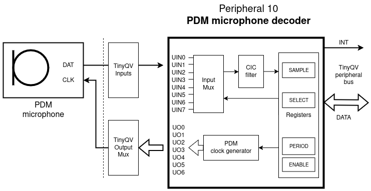

# PDM: Pulse Density Modulation Decoder

Authors: [Jon Nordby](https://jonnor.com), [Martin Stensgård](http://mastensg.net/).

Peripheral index: 10

## What it does

The PDM microphone peripheral lets TinyQV read audio data from a PDM microphone.

The peripheral generates the neccesary clock for the microphone,
and decodes the PDM signal into Pulse Code Modulation (PCM) words.

#### Demo

Spectrogram of "yosys" spoken audio recorded on TinyQV.

.

## How it works

The [PDM](https://en.wikipedia.org/wiki/Pulse-density_modulation) to PCM conversion is done using a [cascaded integrator-comb (CIC) filter](https://en.wikipedia.org/wiki/Cascaded_integrator%E2%80%93comb_filter).

The downsampling/decimation is fixed at `64x`,
which determines the ratio between PDM and PCM clocks.
There is a simple prescaler provided to set the PDM clock,
which can be configured using `PERIOD` register.

The output samples are signed 16-bit integers (int16).
When the peripheral is started (by setting `ENABLE`),
an interrupt is triggered on each new PCM sample.
The values *must* be read from the `SAMPLE` register to clear the interrupt.

The PDM clock is generated on all pins.
So the TinyQV output mux for GPIO to peripherals should be used to control
which external pins are used for PDM clock.

#### System diagram for TinyQV PDM microphone peripheral

## Register map

| Address | Name    | Access | Description                                                         |
|---------|---------|--------|---------------------------------------------------------------------|
| 0x00    | ENABLE  | R/W    | Clock gate (0-1).                                                   |
| 0x04    | PERIOD  | R/W    | PDM clock period (0-255).                                           |
| 0x08    | SELECT  | R/W    | PDM data pin number (0-7).                                          |
| 0x0c    | SAMPLE  | R      | PCM sample, result of conversion.                                   |

#### ENABLE
Bit 0: Enable clock generation.

#### PERIOD
Number of system clock cycles per PDM clock cycle.
For example, to generate a 1 MHz clock signal, set this to 64.

#### SELECT
Which input pin to sample data on.

#### SAMPLE
16-bit signed integer.
Clears interrupt when read.

## How to test

In this example we generate 15 625 PCM samples per second,
by generating a 1 MHz PDM bit clock,
assuming the microcontroller's clock is running at 14 MHz:

1. Setup an interrupt handler for `interrupt10`.
2. Enable TinyQV GPIO on one output for peripheral `10`.
2. Write `14` (cpu clk per pdm clk) to address 4 (CLKP) to set PDM frequency.
3. Write `1` to address `0x00` (CTRL) to start this peripheral running.
4. Every time this peripheral interrupts, read PCM sample from address `0x0c`.
5. Do something interesting with the audio samples! :)

## External hardware

You need a PDM microphone, and connect `CLK` and `DATA`, in addition to `VCC` and `GND`. 

We have tested [Adafruit PDM MEMS Microphone Breakout](https://www.adafruit.com/product/3492),
which has a MP34DT01-M microphone.
Other PDM microphones should also work.

## Usage tips

NOTE 1: the PCM register must be read to clear the interrupt,
and this must happen before the next sample is ready.
At 16kHz this is only 62 microseconds.
Servicing the interrupt must be done in C (not MicroPython),
and requires some care in how the interrupt routine is programmed.
We have managed to do this successfully with a 14 Mhz clock.
We plan to provide some example code for C and MicroPython to make this easier.

NOTE 2: The sensitivity of the microphone is relatively low.
Make sure to have sufficient volume when testing.
Loud speech or have the source quite close to the microphone.

NOTE 3: The first samples from a PDM microphone after powering up and enabling the clock
tends to be garbage.
It is recommended to ignore the first 1000 samples or so.

NOTE 4: There is a non-trivial amount of DC bias present in the output.
If this is problematic in your application, consider a software DC rejection filter.

NOTE 5: A CIC filter has naturally some high-frequency roll-off.
To get a more flat high-frequency response, a FIR or IIR filter can be used to compensate.

## Related projects

The PDM microphone decoder was also submitted as a [stand-alone tile on TinyTapeout sky25a](https://github.com/jonnor/ttsky25a-pdm-microphone).
It works in a similar fasion, but is accessed over SPI instead of the TinyQV peripheral bus.
The tile version returns 24 bit samples,
so it has improved sensitivity / higher SNR for low-volume audio.

