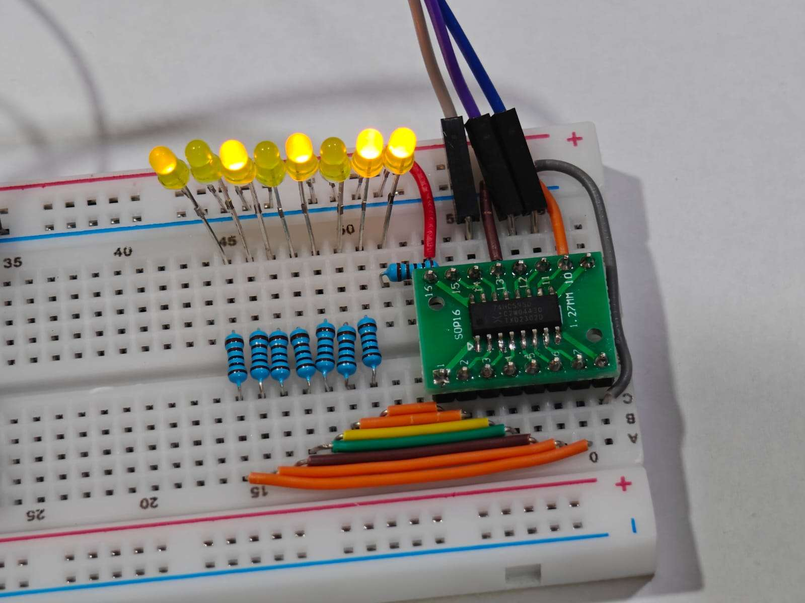

<!---

This file is used to generate your project datasheet. Please fill in the information below and delete any unused
sections.

The peripheral index is the number TinyQV will use to select your peripheral.  You will pick a free
slot when raising the pull request against the main TinyQV repository, and can fill this in then.  You
also need to set this value as the PERIPHERAL_NUM in your test script.

You can also include images in this folder and reference them in the markdown. Each image must be less than
512 kb in size, and the combined size of all images must be less than 1 MB.
-->

# Pulse Transmitter

Author: Han

Peripheral index: 11

## What it does
Pulse transmitter is a versatile peripheral that can transmit digital waveforms of various durations, with optional support for carrier modulation. Various schemes like Pulse Distance, Pulse Width, Manchester encoding, etc. can be easily implemented. Once the program has been configured, no CPU intervention is required. This makes it ideal for remote control transmitter applications and even makes it suitable to drive other devices like the WS2812B addressable LED.

### Specifications
- 256 bits of program data memory
- 24 bit duration counter (8 bit with prescaler)
- 11 bit carrier timer
- 8 + 1 bit program counter
- 8 bit program loop counter
- 4 configurable interrupts (not shown in the architecture diagram)

### Architecture


### What is a symbol?


The transmission level and duration is described by a 2-bit **symbol**.

| Bit 1          | Bit 0           |
|----------------|-----------------|
| TRANSMIT_LEVEL | DURATION_SELECT |

### Modes of operation
The pulse transmitter supports either 1bpe (default) or 2bpe mode.

| Mode                     | Description                                                                                         |
|--------------------------|-----------------------------------------------------------------------------------------------------|
| 1bpe (1 bit per element) | Support up to 256 elements, each 1-bit element is expanded to 2, 2-bit symbols via a lookup table   |
| 2bpe (2 bit per element) | Support up to 128 elements, each 2-bit element is directly mapped to a 2-bit symbol                 |

As described, in 1bpe mode, each bit in program data memory is expanded to 2 symbols.
| Value  | First symbol       |  Second symbol     |
|--------|--------------------|--------------------|
| 0      | low_symbol_0[1:0]  | low_symbol_1[1:0]  |
| 1      | high_symbol_0[1:0] | high_symbol_1[1:0] |

### Duration
Each 2-bit symbol has an associated duration value via one of the six lookup tables.

| Auxillary Bit | Symbol Bit 1 | Symbol Bit 0 | Evaluated Duration   |
|---------------|--------------|--------------|----------------------|
| 0             | 0            | 0            | main_low_duration_a  |
| 0             | 0            | 1            | main_low_duration_b  |
| 0             | 1            | 0            | main_high_duration_a |
| 0             | 1            | 1            | main_high_duration_b |
| 1             | X            | 0            | auxillary_duration_a |
| 1             | X            | 1            | auxillary_duration_b |

To allow for more flexibility in the durations, a 8 bit `auxillary_mask` enables auxillary duration to be used.
- In 1bpe mode, the auxillary mask is mapped to the first 8 elements (expanded to 16 symbols).
- In 2bpe mode, the auxillary mask is mapped to the first 8 elements (8 symbols).

There is also a 4 bit prescaler value each for main and auxillary.
Combined together, total duration ticks = (duration + 2) << prescaler.

### Carrier
The carrier timer is a 11 bit timer that generates a fixed 50% duty cycle square wave. Assuming a clock of 64 MHz, the minimum achievable frequency is approximately 15.6 KHz, while the maximum is 32 MHz. The total duration ticks of a full cycle (high and low) is 2 * (carrier_duration + 1). Note that the carrier output is initially low at the start of the program, and is active when the program is running on a seperate output pin even when `carrier_en` is disabled.

### Other extra features
You can specify at what position in the buffer the program starts, stops, or loopback to. You can choose to not loop, loop up a certain number of times or loop forever. Moreover, instead of counting up, you can count down and send bits in reverse.

### Interrupts
Interrupts can be enabled for certain events like whenever a element is transmitted, whenever the program loops, whenever the program counter reaches the half of the full capacity, or when the program completes. This may be useful in helping to refill the program data memory manually (in the absence of a FIFO) to enable continuous transmission.

### Program status
You can check the program counter, the program loop counter and whether a program is running by reading this peripheral. This may be useful to check for the completion of the program or for busy-waiting. 

## Register map
| Address     | Name              | Access |
|-------------|-------------------|--------|
| 0x00        | REG_0             | W*     |
| 0x04        | REG_1             | W      |
| 0x08        | REG_2             | W      |
| 0x0C        | REG_3             | W      |
| 0x10        | REG_4             | W      |
| 0x20 - 0x3F | PROGRAM_DATA_MEM  | W      |

The 5 configuration registers are initialized to 0. 

For the program memory, the initial value is undefined.

## Writing
Only aligned 32 bit writes are supported in general. However, 8 bit write is allowed at address 0x00 to aid in clearing interrupts, starting or stopping the program.

### REG_0
| Bits  | Name                                |
|-------|-------------------------------------|
| 0     | clear_timer_interrupt               |
| 1     | clear_program_loop_interrupt        |
| 2     | clear_program_end_interrupt         |
| 3     | clear_program_counter_mid_interrupt |
| 4     | start_program                       |
| 5     | stop_program                        |
| 7:6   | *unused*                            |
| 8     | timer_interrupt_en                  |
| 9     | program_loop_interrupt_en           |
| 10    | program_end_interrupt_en            |
| 11    | program_counter_mid_interrupt_en    |
| 12    | loop_forever                        |
| 13    | idle_level                          |
| 14    | invert_output                       |
| 15    | carrier_en                          |
| 16    | downcount                           |
| 17    | use_2bpe                            |
| 19:18 | low_symbol_0                        |
| 21:20 | low_symbol_1                        |
| 23:22 | high_symbol_0                       |
| 25:24 | high_symbol_1                       |
| 31:26 | *unused*                            |

To clear interrupts, start or stop the program, simply write a '1' to corresponding bit.

### REG_1
| Bits  | Name                                |
|-------|-------------------------------------|
| 7:0   | program_start_index                 |
| 15:8  | program_end_index                   |
| 23:16 | program_end_loopback_index          |
| 31:24 | program_loop_count                  |

### REG_2
| Bits  | Name                                |
|-------|-------------------------------------|
| 7:0   | main_low_duration_a                 |
| 15:8  | main_low_duration_b                 |
| 23:16 | main_high_duration_a                |
| 31:24 | main_high_duration_b                |

### REG_3
| Bits  | Name                                |
|-------|-------------------------------------|
| 7:0   | auxillary_mask                      |
| 15:8  | auxillary_duration_a                |
| 23:16 | auxillary_duration_b                |
| 27:24 | auxillary_prescaler                 |
| 31:28 | main_prescaler                      |

### REG_4
| Bits  | Name                                |
|-------|-------------------------------------|
| 10:0  | carrier_duration (11 bits)          |
| 31:11 | *unused*                            |

## Reading
A fixed 32 bits of data are assigned to the `data_out` register within this peripheral's address space. The bottom 8, 16 or all 32 bits are valid on read.
| Bits  | Name                                 |
|-------|--------------------------------------|
| 0     | timer_interrupt_status               |
| 1     | program_loop_interrupt_status        |
| 2     | program_end_interrupt_status         |
| 3     | program_counter_mid_interrupt_status |
| 4     | program_status                       |
| 7:5   | *unused* (value of 0)                |
| 15:8  | program_counter                      |
| 23:16 | program_loop_counter                 |
| 31:24 | *unused* (value of 0)                |

## Pin mappings
| Pin       | Value          | Description                             |
|-----------|----------------|-----------------------------------------|
| uo_out[0] | valid_output   | High when output is active              |
| uo_out[1] | valid_output   | High when output is active              |
| uo_out[2] | user_interrupt | High when any interrupt is asserted     |
| uo_out[3] | carrier_out    | Square wave from carrier                |
| uo_out[4] | carrier_out    | Square wave from carrier                |
| uo_out[5] | final_output   | Pulse transmitter output                |
| uo_out[6] | final_output   | Pulse transmitter output                |
| uo_out[7] | final_output   | Pulse transmitter output                |

Note, the pins are duplicated to allow for some flexibility.

## How to test
### Use with TinyQV C SDK
```
#include <stdbool.h>
#include <csr.h>
#include <uart.h>
#define printf uart_printf
#include <gpio.h>

#define PULSE_TRANSMITTER_ADDRESS PERI_BASE_ADDRESS(11)

// Register struct definitions
// Store these struct in RAM, and write to the peripheral. Do not read directly from the address, it will not give back the struct you wrote.
// Alternatively, you can directly write to the peripheral, without making use of these structs at all.
typedef union {
    struct {
        uint8_t clear_timer_interrupt               : 1; // [0]
        uint8_t clear_program_loop_interrupt        : 1; // [1]
        uint8_t clear_program_end_interrupt         : 1; // [2]
        uint8_t clear_program_counter_mid_interrupt : 1; // [3]
        uint8_t start_program                       : 1; // [4]
        uint8_t stop_program                        : 1; // [5]
        uint8_t _unused_reg_0_a                     : 2; // [7:6]
    };
    uint8_t val;
} pulse_transmitter_write8_reg_0_t;

typedef union {
    struct {
        uint32_t clear_timer_interrupt               : 1; // [0]
        uint32_t clear_program_loop_interrupt        : 1; // [1]
        uint32_t clear_program_end_interrupt         : 1; // [2]
        uint32_t clear_program_counter_mid_interrupt : 1; // [3]
        uint32_t start_program                       : 1; // [4]
        uint32_t stop_program                        : 1; // [5]
        uint32_t _unused_reg_0_a                     : 2; // [7:6]
        uint32_t timer_interrupt_en                  : 1; // [8]
        uint32_t program_loop_interrupt_en           : 1; // [9]
        uint32_t program_end_interrupt_en            : 1; // [10]
        uint32_t program_counter_mid_interrupt_en    : 1; // [11]
        uint32_t loop_forever                        : 1; // [12]
        uint32_t idle_level                          : 1; // [13]
        uint32_t invert_output                       : 1; // [14]
        uint32_t carrier_en                          : 1; // [15]
        uint32_t downcount                           : 1; // [16]
        uint32_t use_2bpe                            : 1; // [17]
        uint32_t low_symbol_0                        : 2; // [19:18]
        uint32_t low_symbol_1                        : 2; // [21:20]
        uint32_t high_symbol_0                       : 2; // [23:22]
        uint32_t high_symbol_1                       : 2; // [25:24]
        uint32_t _unused_reg_0_b                     : 5; // [31:26]
    };
    uint32_t val;
} pulse_transmitter_write_reg_0_t;

typedef union {
    struct {
        uint32_t program_start_index    : 8;  // [7:0]
        uint32_t program_end_index      : 8;  // [15:8]
        uint32_t program_loopback_index : 8;  // [23:16]
        uint32_t program_loop_count     : 8;  // [31:24]
    };
    uint32_t val;   
} pulse_transmitter_write_reg_1_t;

typedef union {
    struct {
        uint32_t main_low_duration_a    : 8;  // [7:0]
        uint32_t main_low_duration_b    : 8;  // [15:8]
        uint32_t main_high_duration_a   : 8;  // [23:16]
        uint32_t main_high_duration_b   : 8;  // [31:24]
    };
    uint32_t val;   
} pulse_transmitter_write_reg_2_t;

typedef union {
    struct {
        uint32_t auxillary_mask         : 8;  // [7:0]
        uint32_t auxillary_duration_a   : 8;  // [15:8]
        uint32_t auxillary_duration_b   : 8;  // [23:16]
        uint32_t auxillary_prescaler    : 4;  // [27:24]
        uint32_t main_prescaler         : 4;  // [31:28]
    };
    uint32_t val;   
} pulse_transmitter_write_reg_3_t;

typedef union {
    struct {
        uint32_t carrier_duration       : 11;  // [10:0]
        uint32_t _unused_reg_4_a        : 21;  // [31:11]
    };
    uint32_t val;
} pulse_transmitter_write_reg_4_t;

typedef union {
    struct {
        uint8_t timer_interrupt_status               : 1; // [0]
        uint8_t program_loop_interrupt               : 1; // [1]
        uint8_t program_end_interrupt                : 1; // [2]
        uint8_t program_counter_mid_interrupt_status : 1; // [3]
        uint8_t program_status                       : 1; // [4]
        uint8_t _unused_reg_0                        : 3; // [7:5]
    };
    uint8_t val;   
} pulse_transmitter_read8_reg_t;

typedef union {
    struct {
        uint32_t timer_interrupt_status               : 1; // [0]
        uint32_t program_loop_interrupt               : 1; // [1]
        uint32_t program_end_interrupt                : 1; // [2]
        uint32_t program_counter_mid_interrupt_status : 1; // [3]
        uint32_t program_status                       : 1; // [4]
        uint32_t _unused_reg_a                        : 3; // [7:5]
        uint32_t program_loop_counter                 : 8;  // [15:8]
        uint32_t program_counter                      : 8;  // [23:16]
        uint32_t _unused_reg_b                        : 8;  // [31:24]
    };
    uint32_t val;   
} pulse_transmitter_read_reg_t;
```
A series of examples intended to be used with the above is presented.

#### [Example] NEC Remote Control Procotol
This protocol uses pulse distance encoding, and requires 38kHz modulation which is simple enough. However, there needs to be a 9 ms high, and 4.5ms low pulse to initiate the transmission. This can be handled by the auxillary mask. In this example, you should expect a command of value 88 (integer) to be sent to address 36 (integer) every 500ms.


```
int main() {
    uint8_t address = 36;
    uint8_t command = 88;

    // Enable all outputs (ensure they are not in debug mode)
    enable_all_outputs();

    // Set outputs 1 - 7 to the pulse transmitter (leaving debug UART untouched)
    set_gpio_func(1, 11); 
    set_gpio_func(2, 11);
    set_gpio_func(3, 11);
    set_gpio_func(4, 11);
    set_gpio_func(5, 11);
    set_gpio_func(6, 11);
    set_gpio_func(7, 11);

    pulse_transmitter_write_reg_0_t reg_0 = {0};
    reg_0.carrier_en = 1;
    reg_0.low_symbol_0 = 0b10;
    reg_0.low_symbol_1 = 0b00;
    reg_0.high_symbol_0 = 0b10;
    reg_0.high_symbol_1 = 0b01;

    pulse_transmitter_write_reg_1_t reg_1 = {0};
    reg_1.program_end_index = 33; // We need to add extra 1 bit for the header, and 1 bit for the stop bit
    
    // For the duration and timer, it can be calculated by
    // For 21 MHz, 1 tick is 47.619 ns
    // For 64 MHz, 1 tick is 15.625 ns
    // total duration ticks = (duration + 2) << prescaler. (or just (duration + 2) * 2ᵖʳᵉˢᶜᵃˡᵉʳ)
    //
    // For 21 MHz,
    // For 563 us, we want 11823 ticks.
    // For 1687 us, we want 35427 ticks.
    // For 9 ms, we want 189000 ticks
    // For 4.5 ms, we want 94500 ticks
    //
    // For 64 MHz,
    // For 563 us, we want 36032 ticks.
    // For 1687 us, we want 107968 ticks.
    // For 9 ms, we want 576000 ticks
    // For 4.5 ms, we want 288000 ticks
    
    // For the carrier_duration, it can be calculated by
    // reg_4.carrier_duration = CLOCK_FREQ / (DESIRED_CARRIER_FREQ * 2) - 2
    // For 21 MHz, and 38kHz carrier. reg_4.carrier_duration = 274
    // For 64 MHz, and 38kHz carrier. reg_4.carrier_duration = 840
    
    // These numbers are for 21 MHz clock (not 64 MHz)
    // pulse_transmitter_write_reg_2_t reg_2 = {0};
    // reg_2.main_low_duration_a = 44;  // Approximately 563 us
    // reg_2.main_low_duration_b = 136; // Approximately 1687 us
    // reg_2.main_high_duration_a = 44; // Approximately 563 us

    // pulse_transmitter_write_reg_3_t reg_3 = {0};
    // reg_3.auxillary_mask = 0b00000001;
    // reg_3.auxillary_duration_a = 183; // Approximately 9 ms
    // reg_3.auxillary_duration_b = 90;  // Approximately 4.5 ms
    // reg_3.auxillary_prescaler = 10;
    // reg_3.main_prescaler = 8;
    //
    // pulse_transmitter_write_reg_4_t reg_4 = {0};
    // reg_4.carrier_duration = 274;

    // These numbers are for 64 MHz clock
    pulse_transmitter_write_reg_2_t reg_2 = {0};
    reg_2.main_low_duration_a = 68;  // Approximately 563 us
    reg_2.main_low_duration_b = 209; // Approximately 1687 us
    reg_2.main_high_duration_a = 44; // Approximately 563 us

    pulse_transmitter_write_reg_3_t reg_3 = {0};
    reg_3.auxillary_mask = 0b00000001;
    reg_3.auxillary_duration_a = 139; // Approximately 9 ms
    reg_3.auxillary_duration_b = 68;  // Approximately 4.5 ms
    reg_3.auxillary_prescaler = 12;
    reg_3.main_prescaler = 9;

    pulse_transmitter_write_reg_4_t reg_4 = {0};
    reg_4.carrier_duration = 840;

    pulse_transmitter_write8_reg_0_t reg8_0 = {0};
    reg8_0.start_program = 1;

    *(volatile uint32_t *)(PULSE_TRANSMITTER_ADDRESS) = reg_0.val;
    *(volatile uint32_t *)(PULSE_TRANSMITTER_ADDRESS + 4) = reg_1.val;
    *(volatile uint32_t *)(PULSE_TRANSMITTER_ADDRESS + 8) = reg_2.val;
    *(volatile uint32_t *)(PULSE_TRANSMITTER_ADDRESS + 12) = reg_3.val;
    *(volatile uint32_t *)(PULSE_TRANSMITTER_ADDRESS + 16) = reg_4.val;

    // We need to add extra 1 bit for the header, and 1 bit for the stop bit
    const uint32_t data0 = 0b1 
                            | (address << 1) 
                            | ((~address & 0xFF) << 9)
                            | (command << 17) 
                            | ((~command & 0x7F) << 25);
    const uint32_t data1 = (~command) >> 7;
    
    *(volatile uint32_t *)(PULSE_TRANSMITTER_ADDRESS + 32) = data0;
    *(volatile uint32_t *)(PULSE_TRANSMITTER_ADDRESS + 32 + 4) = data1;

    while(true) { 
        *(volatile uint8_t *)(PULSE_TRANSMITTER_ADDRESS) = reg8_0.val;
        
        delay_us(500 * 1000);
    }
}
```

#### [Example] WS2812B Addressable LED
The WS2812B needs the bits to be sent MSB (Most Significant Bit) first. Reversing the bits using the CPU is highly inefficient (at least without the bit reverse instruction). Thankfully, we can take advantage of a trick where program counter can count down instead, this effectively sends the bits in reverse. In this example, you should expect 2 connected WS2812B LEDs to light up and animate between colours.


```
int main() {
    // Enable all outputs (ensure they are not in debug mode)
    enable_all_outputs();

    // Set outputs 1 - 7 to the pulse transmitter (leaving debug UART untouched)
    set_gpio_func(1, 11); 
    set_gpio_func(2, 11);
    set_gpio_func(3, 11);
    set_gpio_func(4, 11);
    set_gpio_func(5, 11);
    set_gpio_func(6, 11);
    set_gpio_func(7, 11);

    pulse_transmitter_write_reg_0_t reg_0 = {0};
    reg_0.downcount = 1;
    reg_0.low_symbol_0 = 0b10;
    reg_0.low_symbol_1 = 0b00;
    reg_0.high_symbol_0 = 0b11;
    reg_0.high_symbol_1 = 0b01;

    pulse_transmitter_write_reg_1_t reg_1 = {0};
    reg_1.program_start_index = 23;
    reg_1.program_loopback_index = 23;
    reg_1.program_end_index = 0;
    reg_1.program_loop_count = 1;
 
    // For the duration and timer, it can be calculated by
    // For 21 MHz, 1 tick is 47.619 ns
    // For 64 MHz, 1 tick is 15.625 ns
    // total duration ticks = (duration + 2) << prescaler. (or just (duration + 2) * 2ᵖʳᵉˢᶜᵃˡᵉʳ)
    //
    // We do not need any prescaler.
    //
    // For 21 MHz,
    // For 350 ns, we want 7 ticks.
    // For 850 ns, we want 18 ticks.
    //
    // For 64 MHz,
    // For 350 ns, we want 22 ticks.
    // For 850 ns, we want 54 ticks.

    // These numbers are for 21 MHz clock (not 64 MHz) 
    // pulse_transmitter_write_reg_2_t reg_2 = {0};
    // reg_2.main_low_duration_a = 16;  // Approximately 850 ns
    // reg_2.main_low_duration_b = 5;   // Approximately 350 ns
    // reg_2.main_high_duration_a = 5;  // Approximately 350 ns
    // reg_2.main_high_duration_b = 16;  // Approximately 850 ns

    // These numbers are for 64 MHz clock
    pulse_transmitter_write_reg_2_t reg_2 = {0};
    reg_2.main_low_duration_a = 52;  // Approximately 850 ns
    reg_2.main_low_duration_b = 20;   // Approximately 350 ns
    reg_2.main_high_duration_a = 20;  // Approximately 350 ns
    reg_2.main_high_duration_b = 52;  // Approximately 850 ns

    pulse_transmitter_write8_reg_0_t reg8_0 = {0};
    reg8_0.start_program = 1;

    *(volatile uint32_t *)(PULSE_TRANSMITTER_ADDRESS) = reg_0.val;
    *(volatile uint32_t *)(PULSE_TRANSMITTER_ADDRESS + 4) = reg_1.val;
    *(volatile uint32_t *)(PULSE_TRANSMITTER_ADDRESS + 8) = reg_2.val;

    while(true) {
        for (int t = 0; t < 255; t++) {
            // you can use this for testing as the code for HsvToRgb was obtained online
            //uint32_t color = t;  // animated blue

            HsvColor hsv;
            hsv.h = t;
            hsv.s = 255;
            hsv.v = 255;
 
            RgbColor rgb = HsvToRgb(hsv);

            uint32_t color = (rgb.g << 16) | rgb.r << 8 | rgb.b;
             
            *(volatile uint32_t *)(PULSE_TRANSMITTER_ADDRESS + 32) = color;

            printf("The colour is %d\n", color);

            *(volatile uint8_t *)(PULSE_TRANSMITTER_ADDRESS) = reg8_0.val;

            delay_us(5000);
            printf("Read pulse transmitter %d\n", *(volatile uint32_t *)(PULSE_TRANSMITTER_ADDRESS));
        }
    }
}
```

#### [Extra Example] Driving Serial Devices like the 74HC595 Shift Register / SPI Mode 0 Devices
While the pulse transmitter peripheral is only single channel, signals like the carrier output is exposed. Since both the carrier timer and the program counter uses the same clock, in some scenarios, the carrier output may be repurposed as a clock signal for the 74HC595 Shift Register. The serial data in the program data memory can streamed out. In this example, you should expect the 8 shift register outputs to count in a binary sequence. 




```
int main() {
    // Enable all outputs (ensure they are not in debug mode)
    enable_all_outputs();
    
    // Connect OE (Output Enable) to GND, to enable the shift register output
    // Connect SRCLR (Shift Register Clear) to VCC since we are not using this feature

    set_gpio_func(3, 1);  // Connect RCLK (Latch) to a GPIO 3 (Actual is uo[3] aka out3)
    set_gpio_func(4, 11); // Connect SRCLK (Storage Register Clock) to our carrier_out of our pulse transmitter peripheral
    set_gpio_func(5, 11); // Connect SER (Serial Data) to our final_output of our pulse transmitter peripheral

    gpio_off(3);

    // We want to clock in the data at 8 MHz.
    // Since we are using 1bpe mode, each bit is 2 symbols.
    // By setting the duration value to 2. So each symbol takes 4 ticks.
    // As such the total duration for these 2 symbols is 8 ticks.
    //
    // Coincidentally, the carrier output starts at low level and toggles thereafter.
    // This is compatible with the driving waveforms of a 74HC595 Shift Register.
    // We want to toggle the clock every 4 ticks. So set carrier_duration to 3.
    //
    // Note, with a main system frequency of 64 MHz, the maximum achievable frequency is 16 MHz.

    pulse_transmitter_write_reg_0_t reg_0 = {0};
    reg_0.low_symbol_0 = 0b00;
    reg_0.low_symbol_1 = 0b00;
    reg_0.high_symbol_0 = 0b10;
    reg_0.high_symbol_1 = 0b10;

    pulse_transmitter_write_reg_1_t reg_1 = {0};
    reg_1.program_end_index = 7; // So 8 bits of data

    pulse_transmitter_write_reg_2_t reg_2 = {0};
    reg_2.main_low_duration_a = 2;
    reg_2.main_high_duration_a = 2;

    pulse_transmitter_write_reg_4_t reg_4 = {0};
    reg_4.carrier_duration = 3;

    pulse_transmitter_write8_reg_0_t reg8_0 = {0};
    reg8_0.start_program = 1;

    *(volatile uint32_t *)(PULSE_TRANSMITTER_ADDRESS) = reg_0.val;
    *(volatile uint32_t *)(PULSE_TRANSMITTER_ADDRESS + 4) = reg_1.val;
    *(volatile uint32_t *)(PULSE_TRANSMITTER_ADDRESS + 8) = reg_2.val;
    *(volatile uint32_t *)(PULSE_TRANSMITTER_ADDRESS + 16) = reg_4.val;


    uint8_t i = 0;

    while(true) {
        *(volatile uint32_t *)(PULSE_TRANSMITTER_ADDRESS + 32) = (uint32_t)i;
        *(volatile uint8_t *)(PULSE_TRANSMITTER_ADDRESS) = reg8_0.val;

        // Busy wait until program is done
        while(true) {
            pulse_transmitter_read8_reg_t read;
            read.val = *(volatile uint8_t *)(PULSE_TRANSMITTER_ADDRESS);

            if (!read.program_status) {
                break;
            }
        }

        // Alternatively, for shorter transmissions you can use assembly nops as a delay.
        // This might be advantageous as according to tinyQV docs, a load from peripheral takes at least 3 cycles.
        /*
        __asm__ volatile (
            "nop\n\t"
            "nop\n\t"
            "nop\n\t"
            "nop\n\t"
            "nop\n\t"
            "nop\n\t"
            "nop\n\t"
            "nop\n\t"
        );*/

        // Latch the data manually.
        // There is an alternative approach, which is to directly connect the latch to user_interrupt pin and use program_end_interrupt_en (but its less flexible)
        // There is yet another alternative approach, which is to hook up a ISR, and control the pin in the ISR (but keep in mind of the large interrupt latency)
        gpio_on(3);
        gpio_off(3);

        i += 1;

        delay_us(100 * 1000);
    }
}
```
## External hardware
For testing with an IR LED, the output pins cannot deliver much current, so use a buffer or transistor to drive the LED.