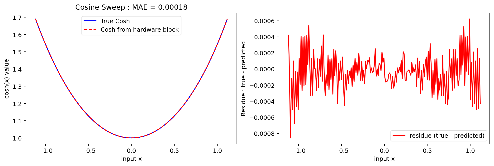

<!---

This file is used to generate your project datasheet. Please fill in the information below and delete any unused
sections.

The peripheral index is the number TinyQV will use to select your peripheral.  You will pick a free
slot when raising the pull request against the main TinyQV repository, and can fill this in then.  You
also need to set this value as the PERIPHERAL_NUM in your test script.

You can also include images in this folder and reference them in the markdown. Each image must be less than
512 kb in size, and the combined size of all images must be less than 1 MB.
-->

# tiny CORDIC

Author: Maciej Lewandowski

Peripheral index: 12

## What it does

This repository implements a Coordinate Rotation Digital Computer (CORDIC) engine that computes standard math functions using only additions, subtractions, and shifts. Supported operations include $sin(x)$, $cos(x)$, $sinh(x)$, $cosh(x)$, square root, and fixed-point multiplication and division—all in a few clock cycles.


## Brief introduction to CORDIC 

Many DSP/control tasks need trigonometric functions and fundamental arithmetic operations (multiplication/division). Lookup tables are fast but memory-hungry. CORDIC offers a compact alternative: within a single hardware block, with much hardware reuse, it evaluates these functions iteratively with additions, subtractions, small lookup table and bit shifts. This method, dating back to the 1959 publication [1] by Jack E. Volder, is utilised in various real-world microcontrollers designed for low power, such as STM32L031 [2], STM32F031 [2], and other models [3]. 

This algorithm is often covered in standard textbooks and notes [4, 5]; therefore, only a brief description is provided to understand how to interact with the underlying hardware. In this design, CORDIC runs for N = 12 (12 clock cycles) with inputs, states and outputs being 16-bit signed, fixed point values. In its unified form, it updates three state variables ($x_i, y_i, z_i$) each iteration. In a general, unified form, this algorithm and the designed hardware solve the following set of equations : 


Key ideas for using it : 
- Inputs/outputs: provide initial ($x_0, y_0, z_0$) via registers (exposed as A, B and the third value is determined automatically). Every iteration, the output changes and provides some value  
- In its most basic functionality, CORDIC has three distinct modes of operation: Circular (m = 1), Linear (m = 0) and Hyperbolic (m = -1). 
- Each of these three modes has two submodes: this configures which of the values we will drive towards zero and is represented by $\sigma_j$. These modes are known as Rotation ($\sigma_{i} = sign(z_i)^{+}$) and Vectoring ($\sigma_{i} = -sign(y_i)^{+}$)


### Operating modes 
To compute any of the previously mentioned functions, the user must set the mode m, select a rotating or vectoring configuration, and then specify the inputs. In most useful cases, we only need to set at most two values, and the module can automatically set the third value. While setting up three values allows for computing more, these functions are often a combination of basic functions (for example, outputs would compute A cos(a) + B sin(a)). Because of that and to save resources, there are only 2 16-bit inputs. There are also two 16-bit outputs, out1 and out2.

Let $A, B$ be the register inputs and $out1, out2$ the outputs.

### What each mode returns
| Mode (m)|  Submode    | A |B | out1 | out 2|
|---------|--------------|:------:|-------------|-|-|
| 1    | Rotating       |  a   | - |$cos(a)$|$sin(a)$|
| 1    | Vectoring      |  a    | b |$K_{C} \sqrt{a^2+b^2}$|$tan^{-1}(\frac{b}{a})$|
| 0    | Rotating     |  a    | b |$a \cdot b$| error $\epsilon$|
| 0    | Vectoring |   a    | b | $\frac{b}{a}$| error $\epsilon$|
| -1    | Rotating      |   a    | - | $cosh(a)$ | $sinh(a)$|
| -1    | Vectoring     |   a    |  b | $K_{H} \sqrt{a^2 - b^2}$ |$tanh^{-1}(\frac{b}{a})$|
| -1    | Vectoring    |   a + 1.0    | a - 1.0 |$2 K_{H}\sqrt{a}$|0.5 * ln(a)|

### Note about Scaling
- The rotating path returns the values directly and can be interpreted right away (pre-scaling).
- For vectoring, circular mode, the output has to be post-scaled. The output will be multiplied by the circular gain/constant $K_C \approx 1.646760$; therefore, to get the exact value, the user has to multiply by the inverse of that.  
- Simillarly, hyperbolic rotating output values directly. Vectoring mode, however, outputs again values multiplied by Hyperbolic gain/constant: $K_H \approx 1.207497$.  
- $\epsilon$ here can help check whether the output is correct or not. It should be close to 0 if the values are set correctly

### References
- [1] [J. E. Volder, "The CORDIC Trigonometric Computing Technique," in IRE Transactions on Electronic Computers, vol. EC-8, no. 3, pp. 330-334, Sept. 1959, doi: 10.1109/TEC.1959.5222693.](https://ieeexplore.ieee.org/document/5222693)
- [2] [STM32 DT0085 application note: Coordinate rotation digital computer algorithm (CORIDIC)](https://www.st.com/resource/en/design_tip/dt0085-coordinate-rotation-digital-computer-algorithm-cordic-to-compute-trigonometric-and-hyperbolic-functions-stmicroelectronics.pdf)
- [3] [Application note AN5325 : How to use the CORDIC to perform mathematical functions on STM32 MCUs](https://www.st.com/content/ccc/resource/technical/document/application_note/group1/50/31/98/a8/b5/da/4e/a4/DM00614795/files/DM00614795.pdf/jcr:content/translations/en.DM00614795.pdf)
- [4] [CORDIC ALGORITHM AND IMPLEMENTATIONS](https://web.cs.ucla.edu/digital_arithmetic/files/ch11.pdf) 
- [5] [Chapter 24: CORDIC Algorithms and Architectures](https://people.eecs.berkeley.edu/~newton/Classes/EE290sp99/lectures/ee290aSp996_1/cordic_chap24.pdf)

## Sweeps
There is a strong dependency of the accuracy of the obtained results on the number of iterations (not as much on the width). 
Our cocotb tests run input sweeps (≈100–200 points) across each function's domain, compare the RTL output against a NumPy reference, and report errors.

Methods :
- Circular/hyperbolic rotating results are shown in Q2.14. They are then converted to double floating point, and the residue between this value and the computed value by numpy is recorded
- Linear modes use the Q-format selected by register 0x03
- We report mean absolute error (MAE) for each of the functions 

### Computed Sin(x) value (Verilog simulation compared against Python numpy values)


### Computed Cos(x) value (Verilog simulation compared against Python numpy values)


### Computed Sinh(x) value (Verilog simulation compared against Python numpy values)


### Computed Cosh(x) value (Verilog simulation compared against Python numpy values)


### Computed sqrt value (Verilog simulation compared against Python numpy values)
The value is obtained from out1, then shifted by two and multiplied by the inverse of $\frac{1}{K_{h}} \approx 1.2075$. Finally, the value is compared against the value obtained from numpy.


## Register map

Document the registers that are used to interact with your peripheral

| Address | Name         | Access | Description |
|--------:|--------------|:------:|-------------|
| 0x00    | config       |  R/W   | Control bits {is_rot, mode[1:0], start}. See §Config (0x00). |
| 0x01    | input A      |   W    | Operand A (per-mode; see details). |
| 0x02    | input B      |   W    | Operand B (per-mode; see details). |
| 0x03    | 1.0 position |   W    | Q-format selector (e.g., 11 -> Q5.11; 14 -> Q2.14). |
| 0x04    | output 1     |   R    | Primary result. |
| 0x05    | output 2     |   R    | Secondary result / diagnostic. |
| 0x06    | status       |   R    | 0=ready, 1=busy, 2=done. |


## Detailed description of the registers

### Config (0x00)
| Bits  | Name   | Meaning                               |
|:-----:|--------|----------------------------------------|
| [3]   | is_rot | 1 = Rotating, 0 = Vectoring            |
| [2:1] | mode   | 00=CIRCULAR, 01=LINEAR, 10=HYPERBOLIC |
| [0]   | en  | Write 1 to start; auto-clears after 1 clock cycle         |

### input A (0x01)
- __Circular and Rotating mode__ : angle $\alpha$ in radians, signed fixed-point. The value is represented as Q2.14 in 16-bit mode. The value can range from -1.7178 rad to 1.7178 rad (+/-98.42 degrees)
- __Circular and Vectoring mode__: First component representing a for $\sqrt{a^2 + b^2}$ (out1) and ($tan^{-1}(\frac{b}{a})$). Because the value is not scaled (Output multiplied by $K_{C}$), it's up to the user to set the fixed point format.
-  __Linear and Rotating mode__: Multiplicand a represented in fixed point format. To control the position of 1.0, you need to use register 0x03. To give an example,  if register 0x03 is set to 11, this input a and input b represent the value in Q5.11 format.
- __Linear and Vectoring mode__: Denominator a for $\frac{b}{a}$. Same Q-format for Linear Rotating mode.
- __Hyperbolic and Rotating mode__ : Argument a for sinh / cosh. Represented as Q2.14. Range limitation : [-1.1161, 1.1161].  
- __Hyperbolic and Vectoring mode__ :  first input a for $\sqrt{a^2 - b^2}$. The Output here can represent any fixed point __as long as it is greater than then second input B__ ($\sqrt{a^2 -b^2}$ becomes undefined then), because the Output is __not scaled__ (not multiplied by inverse of $K_{H}$ due to resource limitations). It is up to user to either multiply by $\frac{1}{K_{H}} \approx \frac{1}{0.82816} \approx 1.207496$ or use it the computed value of $K_{H} \sqrt{a^{2} - b^{2}}$. <br>

### input B (0x02)
- __Circular and Rotating mode__ : Ignored. 
- __Circular and Vectoring mode__: second component b, for which we will compute the magnitude and atan, which is $\sqrt{a^2 + b^2}$. Because the value is not scaled (Output multiplied by $K_{C}$), it's up to the user to set the fixed point format.
- __Linear and Rotating mode__: Multiplicand b in variable fixed point format: to control where the position of 1.0 is. To give an example,  if register 0x03 is set to 11, this input b and input a represent a value in Q5.11 format.
- __Linear and Vectoring mode__: b represents Numerator ($\frac{b}{a}$) in variable fixed point format. To control the position of 1.0, you have to use register 0x03. To give an example,  if register 0x03 is set to 11, this input b and input a represent a value in Q5.11 format. 
- __Hyperbolic and Rotating mode__ Ignored. 
- __Hyperbolic and Vectoring mode__ :  Second value B for hyperbolic mode. This value must be smaller than A; otherwise, the result will be incorrect. The Output here can represent any fixed point. The Output is __not scaled__ (not multiplied by inverse of $K_{H}$ due to resource limitations). It is up to user to either multiply by $\frac{1}{K_{H}} \approx \frac{1}{0.82816} \approx 1.207496$ or use it the computed value of $K_{H} \sqrt{a^{2} - b^{2}}$.

# Q-format (1.0 position) (0x03)
- This value stores the number of fractional bits (for example, 10 -> Q6.10 in 16-bit mode). This register is used for linear modes and outputs in this format.

### Output 1 (0x04)
- __Circular and Rotating mode__ : returns cos(a), stored in Q2.14 format. 
-  __Circular and Vectoring mode__: returns $K_{C} \cdot \sqrt{A^2 + B^2}$ where $K_{C} = 1.64676$.
-  __Linear and Rotating mode__: returns $A \cdot B$ in a fixed float format configured by the register 0x03. <br> 
- __Linear and Vectoring mode__: returns $\frac{B}{A}$ in a fixed float format by the register 0x03. 
- __Hyperbolic and Rotating mode__ : returns cosh(A) stored in Q2.14 format. 
- __Hyperbolic and Vectoring mode__ :  returns $K_{H} \cdot \sqrt{A^2 - B^2}$ where $K_{H} \approx 0.82816$. The Output is not scaled: this means that it is up to the programmer and software to interpret this value (with a consistent format of A, B and $K_H$, it's possible to get a wide range of fixed points) <br>

### Output 2 (0x05)
- __Circular and Rotating mode__ : returns sin(A), stored in Q2.14 format. 
- __Circular and Vectoring mode__: returns $tan^{-1}(\frac{B}{A})$ 
- __Linear and Rotating mode__: In the unified CORDIC, this returned value corresponds to the final value of $z$ (z after N iterations). This value is quite difficult to interpret, but it is somehow dependent on the error. In the ideal case, this should be 0 (in which case the output 1 corresponds to the correct value). Large magnitude values can indicate that the conversion was unsuccessful. 
- __Linear and Vectoring mode__: In the unified CORDIC, this returned value corresponds to the final value of $y$ (y after N iterations). This value is quite difficult to interpret, but it is somehow dependent on the error. In the ideal case, this should be 0 (in which case the output 1 corresponds to the correct value). Large magnitude values can indicate that the conversion was unsuccessful. 
- __Hyperbolic and Rotating mode__ : returns sinh(A) stored in Q2.14 format.
- __Hyperbolic and Vectoring mode__ :  returns $tanh^{-1}(\frac{y}{x})$ stored in Q2.14 format <br>

### Status (0x06)
| Value | Meaning |
|:----:|---------|
| 0    | ready   |
| 1    | busy    |
| 2    | done    |

## How to test
This section shows how to exercise the peripheral with small examples using pseudo-C.
### trigonometric function (sin and cos)
In circular rotating mode, the core returns cos(a) and sin(a) simultaneously. Inputs/Outputs use Q2.14 fixed point (16-bit signed). Valid input range is about [-1.7178,1.7178] rad (+/-98.42 degrees) simultaneously. The input is an angle. 

An example use of getting sin and cosine of 30 degrees (which is $\frac{\pi}{6} \approx 0.52359877$, which corresponds to b00100001_10000011 ).

```c
// convert angle to fixed point value to angle
int16_t angle_q = 0b00100001_10000011;

// 1) Write angle to A (0x01)
write_to_register(0x01, angle_q)

// 2) Start: is_rot=1, mode=00 (CIRCULAR), start=1
//    Bit layout: [3]=is_rot, [2:1]=mode, [0]=start
write_to_register(0x00,  0b1_00_1);

// 3) Poll status until DONE (0=READY, 1=BUSY, 2=DONE)
while (read_the_register(0x06) == 1) { /* wait */ }

// 4) Read results (Q2.14)

// cos(a)
int16_t cos_q = read_the_register(0x04); 

// sin(a)
int16_t sin_q = read_the_register(0x05);
```

### multiplication 
Multiplication can be done using a linear (m = 0) rotating mode. In this case, you must set 3 registers: input A (0x01), input B(0x02) and Q-format (0x03). Below there is an example of multiplication of 1.25 * 2.5 within Q5.11 format (iiiii_ddddddddddd)

```c
// 1) Select Q-format: F=11  --> Q5.11 (1.0 == 2048)
write_to_register(0x03, 11);

// 1) Convert to fixed point
// A = 1.25 * 2^11 = 2560  -> 0b00001_01000000000
// B = 2.50 * 2^11 = 5120  -> 0b00010_10000000000
int16_t A = 0b00001_01000000000; // 2560
int16_t B = 0b00010_10000000000; // 5120

// 2) put these values into the register
write_to_register(0x01, A);
write_to_register(0x02, B);


// 2) Start: is_rot=1, mode=01 (LINEAR), start=1
//    Bit layout: [3]=is_rot, [2:1]=mode, [0]=start
write_to_register(0x00,  0b1_01_1)

// 3) Wait until DONE (0=READY, 1=BUSY, 2=DONE)
while (read_the_register(0x06) == 1) {}

// 4) Read results
// out1 = A*B in Q5.11
int16_t prod_q = read_the_register(0x04);  
// out2 = residual ( \approx 0 ideally)
int16_t resid  = read_the_register(0x05);  ```
```

### Division 
Division can be done using linear (m = 0) and vectoring mode. In this case, we have to set 3 registers: input A (0x01), input B(0x02) and Q-format (0x03). Again, both inputs and the outputs use the Q-format from the 0x03 register.
 Below there is an example of division of 9.12 / 6.3 within Q5.11 format (iiiii_ddddddddddd)

```c
// 1) Select Q-format: F=11  --> Q5.11
write_to_register(0x03, 11);

// 2) Convert to fixed point (round-to-nearest recommended)
// convert A=6.3 to fixed point.  A = 0b00110_01001100110
int16_t A = 0b00110_01001100110; // 12902

// convert B=9.12 to fixed point. A = 0b01001_00011110110
int16_t B = 0b01001_00011110110; // 18678

// 3) Write the values 
write_to_register(0x01, A); // denominator
write_to_register(0x02, B); // numerator

// 4) Start: is_rot=0, mode=01 (LINEAR), start=1
//    Bit layout: [3]=is_rot, [2:1]=mode, [0]=start
write_to_register(0x00,  0b0_01_1);

// 5) Wait until DONE
while (read_the_register(0x06) == 1) {}

// 6) Read results
int16_t quot_q = read_the_register(0x04); // out1 = B/A in Q5.11
int16_t resid  = read_the_register(0x05); // out2 = residual
```

### sinh and cosh 
In hyperbolic rotating mode, the core will return a cosh(a) and a sinh(a) simultaneously. Inputs/outputs use Q2.14 fixed point (16-bit signed), and the valid input range is [-1.1161, 1.1161] due to resource limit. It is possible to obtain larger values than those in software using hyperbolic identities. 

An example use of getting sinh and cosh of ln (2) (which is 0.69314, which corresponds to b00100001_10000011 ).
```c
// 1) convert A = ln(2) = 0.693147 which 
// is approximately 00_10110001011101
int16_t A = 0b00_10110001011101; // 11357

// 2)  put the value of A into the register
write_to_register(0x01, A)

// 3) Start: is_rot=1, mode=10 (HYPERBOLIC), start=1
//    Bit layout: [3]=is_rot, [2:1]=mode, [0]=start
write_to_register(0x00, 0b1_10_1)

// 4) Wait until DONE (0=READY, 1=BUSY, 2=DONE)
while (read_the_register(0x06) == 1) {}

// 5) Read results (Q2.14)
uint16_t cosh_q = read_the_register(0x04);
uint16_t sinh_q = read_the_register(0x05);
```

### Square root 
The vectoring mode in hyperbolic mode might not look very interesting; however, it allows for the computation of many useful functions (such as the square root, ln, exp, etc.). In here, let's use the square root mode by inputting A = x + 1 and B = x -1. This gives 
$$out1= K_{H}\sqrt{(x+1)^2 -(x-1)^2} =K_{H} \sqrt{x^2 +2x + 1 - x^2 + 2x - 1} = 2K_{H} \sqrt{x}$$
Due to hardware limitations, the Output is not scaled. It is up to the programmer to interpret the value, and multiply it by a fixed point that matches the specification.
In the example below, we compute the square root of 2.5, which is specified in Q5.11 format
```c
// 0) decide on format

// 1) Set the inputs in the decided format
// input is x=2.5 in Q5.11 
// to compute the square root, we need to set A = x + 1
// to compute the square root, we need to set B = x - 1

// convert A=3.5 to fixed point.
// A = 2^{2} + 2^{0} + 2^{-1} = 00011_10000000000
int16_t A = 0b00011_10000000000;

// convert B=1.5 to fixed point.
// A = 2^{0} + 2^{-1}  = 00001_10000000000
int16_t B = 0b00001_10000000000;

// 2) write to registers
// put the value of A into the register
write_to_register(0x01, A);

// put the value of B into the register
write_to_register(0x02, B);

// 3) Start: is_rot=0, mode=10 (HYPERBOLIC), start=1
//    Bit layout: [3]=is_rot, [2:1]=mode, [0]=start
write_to_register(0x00, 0b0_10_1);

// 4) Wait until DONE
while (read_the_register(0x06) == 1) {}

// 5) Read out1 (Q5.11): out1 = 2 * K_H^{-1} * sqrt(x)
uint16_t out1_q = read_the_register(0x04);
```

## External hardware

None required. This peripheral augments the core with fast trigonometric, hyperbolic, multiply/divide, and square-root operations. Typical uses include audio (waveform generation) and control (e.g., motor control), where low-power math and few clock cycles per value are usable.