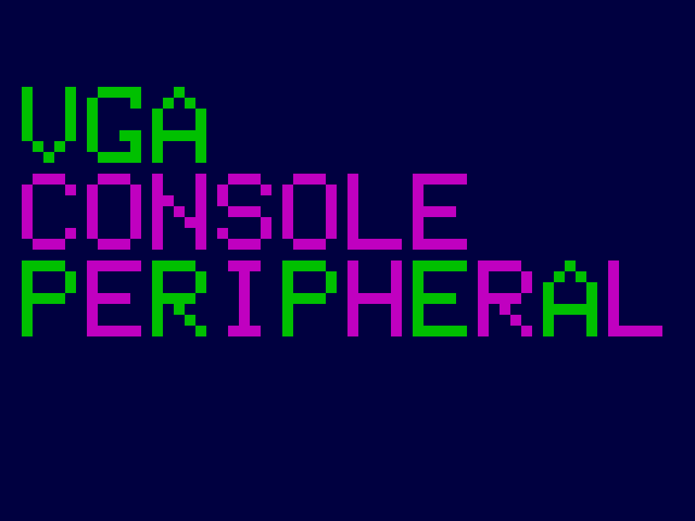

<!---

This file is used to generate your project datasheet. Please fill in the information below and delete any unused
sections.

The peripheral index is the number TinyQV will use to select your peripheral.  You will pick a free
slot when raising the pull request against the main TinyQV repository, and can fill this in then.  You
also need to set this value as the PERIPHERAL_NUM in your test script.

You can also include images in this folder and reference them in the markdown. Each image must be less than
512 kb in size, and the combined size of all images must be less than 1 MB.
-->

# VGA character console

Author: Ciro Cattuto

Peripheral index: 13

## What it does

The peripheral provides a 10x3 character VGA console supporting printable ASCII characters (32-126). It generates a 1024x768 60Hz VGA signal (64 MHz pixel clock) suitable for a [TinyVGA PMOD](https://github.com/mole99/tiny-vga). The 10x3 text buffer is memory-mapped, hence it is possible to set individual characters using simple writes to the peripheral's registers. Non-printable ASCII codes are displayed as filled blocks. The peripheral triggers the user interrupt once per frame refresh, after the bottom line of the screen has been painted. The console text is uninitialized at reset.

## Register map

- The 10x3 character buffer is exposed via registers `CHAR0` to `CHAR29`. When writing to these registers, the low 7 bits of the written value contain the printable ASCII code, bit 7 controls the color of the character (0=color1, 1=color2).
- Writing to `TXTCOL1` sets text color 1 (low 6 bits, 2 bits per color channel, BBGGRR order). The default color is green (001100).
- Writing to `TXTCOL2` sets text color 2 (low 6 bits, 2 bits per color channel, BBGGRR order). The default color is magenta (110011).
- Writing to `BGCOL` sets the background color (low 6 bits, 2 bits per color channel, BBGGRR order). The default color is dark blue (010000).
- `VGA' provides access to VGA timing signals and character generator information: bit 0 is the interrupt signal, bit 1 is vsync, bit 2 is hsync. Reading `VGA` clears the peripheral's interrupt signal.

| Address | Name    | Access | Description                                                         |
|---------|---------|--------|---------------------------------------------------------------------|
| 0x00    | CHAR0   | W      | ASCII code (bits[6:0]) and color (bit 7) of character at position 0 |
| 0x01    | CHAR1   | W      | ASCII code and color of character at position 1                     |
| 0x02    | CHAR2   | W      | ASCII code and color of character at position 2                     |
| ...     | ...     | W      | ...                                                                 |
| 0x1B    | CHAR27  | W      | ASCII code and color of character at position 27                    |
| 0x1C    | CHAR28  | W      | ASCII code and color of character at position 28                    |
| 0x1D    | CHAR29  | W      | ASCII code and color of character at position 29                    |
| 0x30    | TXTCOL1 | W      | Text color 1: xxBBGGRR (default 001100, green)                      |
| 0x31    | TXTCOL2 | W      | Text color 2: xxBBGGRR (default 110011, magenta)                    |
| 0x32    | BGCOL   | W      | Background color: xxBBGGRR (default 010000, dark blue)              |
| 0x3F    | VGA     | R      | VGA status: interrupt (bit 0), vsync (bit 1), hsync (bit 2). Clears interrupt on read. |

## How to test

Write 65 to register CHAR0. An green "A" character should appear at the top left of the VGA display.

## External hardware

[TinyVGA PMOD](https://github.com/mole99/tiny-vga) for VGA output.

