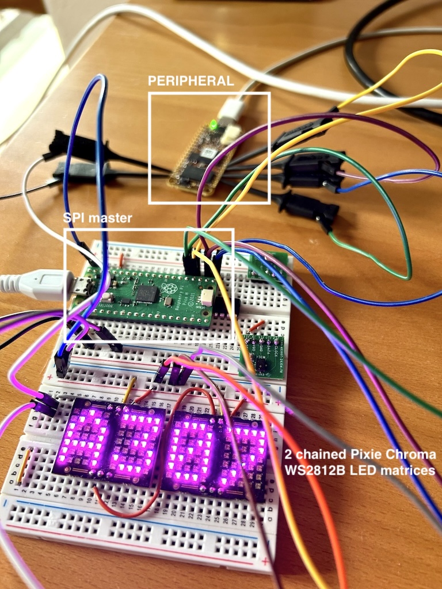

<!---

This file is used to generate your project datasheet. Please fill in the information below and delete any unused
sections.

You can also include images in this folder and reference them in the markdown. Each image must be less than
512 kb in size, and the combined size of all images must be less than 1 MB.
-->

# LED strip driver

Author: Ciro Cattuto

Peripheral index: 18

## What it does

Minimal WS2812B LED strip driver for TinyQV, meant for displaying debugging information.

The output signal to the LED strip is `uo_out[1]`. To push pixels to the strip, load the color into registers G/R/B and then write to register CTRL. At boot, the default color is red (0, 0x20, 0). It is possible to push multiple pixels of the same color, and to clear pixels, i.e., push black pixels (0,0,0) without having to change the color registers. It is possible to control whether a LED strip reset (`uo_out[1]` held low for over 300us) is sent after the pixel(s) are sent to the strip.

The driver is based on a WS2812B Verilog module that has been tested in FPGA and in silicon (see [this TinyTapeout project](https://github.com/ccattuto/tt07-serial-charmatrix/)).

The driver is generic, but also supports the specific case of one or more [Pixie Chroma](https://connornishijima.github.io/Pixie_Chroma/) chainable devices, each featuring two 5x7 LED matrices of WS2812B LEDs. In this case, it is possible to directly write ASCII characters to the LED matrix by using register CHAR (0x04). 5x7 matrix representations for printable ASCII characters are supported using the font from [Arduino Microview Library](https://github.com/geekammo/MicroView-Arduino-Library/blob/master/font5x7.h) encoded in a character ROM. Non-printable ASCII characters are shown as a filled rectangle.

The state of the driver can be checked by reading register CTRL (0x00). If bit 0 is 1 the driver is ready to receive a command, otherwise it is busy sending data to the strip. Register writes while the driver is busy are ignored. When using this peripheral, poll register CTRL until bit 0 is set, and then write to a register. Notice that - because of how chainable WS2812B LEDs work - using multiple writes to create patterns or to write strings requires the interval between register writes to be shorter than the reset interval of the strip. This interval is strongly dependent on LED model but typically falls in the 50-100 us range. Therefore, the time is takes to poll CTRL and then to write a register must be shorter than the reset interval of the LED strip.

## Register map

| Address | Name  | Access | Description                                                         |
|---------|-------|--------|---------------------------------------------------------------------|
| 0x00    | CTRL  | W      | Push pixel(s) to strip. Bits [5:0] contain the number of pixels to send. If bit 6 = 0, the loaded color (registers G/R/B) is used. If bit 6 = 1, color (0,0,0) is used (i.e., pixels are cleared). Setting bit 7 = 1 resets the strip after pushing the pixel(s). Write is ignored if the peripheral is not ready. |
|         |       | R      | Status: bit 0 = peripheral ready                                    |
| 0x01    | G     | W      | Green color component                                               |
| 0x02    | R     | W      | Red color component                                                 |
| 0x03    | B     | W      | Blue color component                                                |
| 0x04    | CHAR  | W      | Push a printable ASCII character to the strip, using the loaded color (registers G/R/B). It assumes that the strip is a chain of 5x7 LED matrices. Bits 6:0 contain the ASCII code of the character. Non-printable ASCII characters (ASCII code <32 or >126) are displayed as filled blocks. Bit 7 = 1 resets the strip after pushing the character's pixels. Write is ignored if the peripheral is not ready. |

## How to test

Connect the data input of a WS2812B LED strip to `uo_out[1]`. Write 0x81 to register CTRL (0x00), check that a red pixel is displayed by the strip.

If you have a [Pixie Chroma](https://connornishijima.github.io/Pixie_Chroma/), connect `uo_out[1]` to DATA_IN. Write 0xC1 to register CHAR (0x04). A red "A" character should appear.

## External hardware

WS2812B LED strip or Pixie Chroma matrix with DATA_IN connected to `uo_out[1]`.

## FPGA-tested

