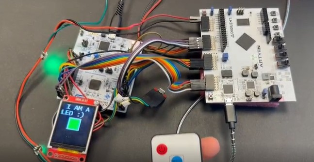

<!---
This file is used to generate your project datasheet. Please fill in the information below and delete any unused
sections.

You can also include images in this folder and reference them in the markdown. Each image must be less than
512 kb in size, and the combined size of all images must be less than 1 MB.
-->

# WS2812B impostor

Author: Javier MS

Peripheral index: 19

## What it does

This module emulates the behavior of a WS2812B addressable RGB LED. It is designed to integrate  into a daisy-chained WS2812B LED strip, acting as a "virtual LED" or "impostor" within the chain.

It receives data on the `DIN` input pin (typically connected to the previous LED in the chain or a microcontroller), extracts and stores the RGB values destined for it, and then forwards the remaining data to the next element in the chain via the `DOUT` output pin.     

[Demo video on LinkedIn](https://www.linkedin.com/feed/update/urn:li:activity:7353011346612850689/)

This passthrough behavior mimics a real WS2812B LED. This allows the module to coexist with actual LEDs or other impostor modules in a daisy-chain configuration.

Applications:
- Simulation or logging tools for WS2812B protocols.
- Its cool as hell, how about instead of colours we control servos.    

    

## Register Map

| Address | Name                     | Access | Description                                                                 |
|---------|--------------------------|--------|-----------------------------------------------------------------------------|
| 0x00    | reg_r                  | R      | Last received **Red** byte                                                  |
| 0x01    | reg_g                  | R      | Last received **Green** byte                                               |
| 0x02    | reg_b                  | R      | Last received **Blue** byte                                                |
| 0x03    | rgb_clear              | W      | Write 0x00 to clear rgb_ready; after taking effect,resets back to 0x01 internally |
| 0x04    | rgb_ready              | R      | 0xFF if new RGB data received (latched), 0x00 only after cleared by rgb_clear |
| 0x05    | prescaler_commit       | W      | Write any value to **apply** new prescaler settings from shadow registers  |
| 0x06–0x07 | shadow_idle_ticks    | W      | New idle_ticks value (16-bit, LSB at 0x04) – applied on prescaler_commit |
| 0x0A–0x0B | shadow_threshold_cycles | W   | New threshold_cycles value (16-bit, LSB at 0x0C) – applied on prescaler_commit |
| 0x0E    | din_select            | W      | Selects which ui_in[x] pin to use as the input (0x00–0x07)             |

> **Note:** The WS2812B protocol sends colors in **GRB** order. This peripheral captures and reorders them internally for convenience.

---

## Prescaler Configuration

The peripheral allows tuning of internal timing thresholds by writing 16-bit values into shadow registers:

- `shadow_idle_ticks` defines how long the line must stay low to consider the bus idle 50000ns.    
 Is calculated as idle_ticks=50000/(clk_preiod_ns), for example with a clock of 64Mhz (or T=15.625ns) idle_ticks=50000/15,625=3200
- `shadow_threshold_cycles` defines the pulse width threshold (in clock cycles) to determine if a bit is a `1` or a `0` 900 ns.    
Is calculated as threshold_cycles=900/(clk_preiod_ns), for example with a clock of 64Mhz (or T=15.625ns) threshold_cycles=900/15,625=58 (57.6)
These values **only take effect** after writing to `prescaler_commit` (address `0x05`), making the update atomic.
The default preescaler values after reset are 3840 and 38, configured to work with a clock ≈62.5 MHz (T=16ns sharp), but probably there is enough wiggle room in the ws2812b timing tolerances to work with 64Mhz aswel with default configurations.    

## How to Test

1. (Optional) Adjust timing parameters if needed: (prescalers are for 62.5 MHz clock by default after reset)
   - Write a new 32-bit `idle_ticks` value to addresses `0x04–0x07`
   - Write a new 32-bit `threshold_cycles` value to addresses `0x0C–0x0F`
   - Write any value to `prescaler_commit` (e.g. `0xFF`) to address `0x05` to **commit** the new values

2.  (Optional) Select DIN input:(DIN is `ui_in[1]` by default after reset)
   - Write a new 8-bit `din_select` value to addresses `0x010`

3. Connect a WS2812B signal generator (e.g. microcontroller or FPGA) to the `DIN` input (default:`ui_in[1]`).

4. Transmit a standard WS2812B data frame with one or more 3-byte RGB values.

5. Once the first 8×3 = 24 bits are received, the peripheral will:
   - Store the first RGB triplet in the internal registers
   - Set the `rgb_ready` register to `0xFF` to indicate data availability

6. You can now read:
   - `reg_r` (0x00) for RED
   - `reg_g` (0x01) for GREEN
   - `reg_b` (0x02) for BLUE

7. To acknowledge the received data and re-arm the peripheral:
   - Write `0x00` to the `rgb_clear` register (0x03)
   - The `rgb_ready` flag will automatically reset to `0x00`

## External Hardware

- **WS2812B Driver or Controller** (e.g. microcontroller, FPGA logic, cheap chinese led driver)
- **Additional WS2812B LEDs or Impostor Modules**:
  This peripheral supports forwarding of the remaining data to downstream LEDs via the `DOUT` pin, enabling full compatibility with mixed chains of real and imposter devices.

