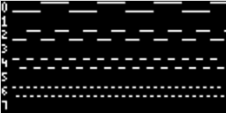
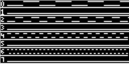
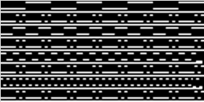

<!---

This file is used to generate your project datasheet. Please fill in the information below and delete any unused
sections.

The peripheral index is the number TinyQV will use to select your peripheral.  You will pick a free
slot when raising the pull request against the main TinyQV repository, and can fill this in then.  You
also need to set this value as the PERIPHERAL_NUM in your test script.

You can also include images in this folder and reference them in the markdown. Each image must be less than
512 kb in size, and the combined size of all images must be less than 1 MB.
-->

# TinyQV Waveforms

Author: Meinhard Kissich

Peripheral index: 25

## What it does

Have you ever wanted to display some nice logic-level waves on an OLED display, but your bit-serial RISC-V core was not powerful enough to feed the graphics data to the display fast enough? Maybe not, but anyway, you can do it now. The tinyQV-Waveforms peripheral takes care of moving around all graphics data. You only need to select a channel (track) and write the binary data (1 byte at a time, i.e., 8 sequential data points) to the peripheral. Everything else is automatically handled in hardware. You can spend your precious and limited computing power of your bit-serial core on other tasks. Finally, the peripheral is optimized for area to avoid negating the advantage of a bit-serial core.

| line numbers<br>no ground line | line numbers<br>ground line   | no line numbers<br>no ground line |
| ------------------------------ | ----------------------------- | --------------------------------- |
|   |  |      |


## Connections

| Peripheral  | SSD1306 |
| ----------- | ------- |
| `uo_out[3]` | nCS     |
| `uo_out[2]` | SDI     |
| `uo_out[1]` | SCK     |
| `uo_out[4]` | DC      |

## Usage

By example of the testbench code:

```Python
# Note: ensure to have enough time between commands or
#       to check the `ready` bit
# Keep cs low, go to command mode
await tqv.write_reg(CONF, 0b0_0_0010)

# Tunnel init sequence to oled
await tqv.write_reg(SPI, 0xD5)
await tqv.write_reg(SPI, 0xF0)
await tqv.write_reg(SPI, 0x8D)
await tqv.write_reg(SPI, 0x14)
await tqv.write_reg(SPI, 0xA1)
await tqv.write_reg(SPI, 0xC8)
await tqv.write_reg(SPI, 0x81)
await tqv.write_reg(SPI, 0xCF)
await tqv.write_reg(SPI, 0xD9)
await tqv.write_reg(SPI, 0xF1)
await tqv.write_reg(SPI, 0xAF)
await tqv.write_reg(SPI, 0x10)
await tqv.write_reg(SPI, 0x02)

# enable channel numbers, enable ground line, CS to default, DC low, prescaler
await tqv.write_reg(CONF, 0b1_1_1_1_0001)

# Select Row 0
await tqv.write_reg(SEL, 0)

# Write first 16 sample points in row 0
await tqv.write_reg(ADDR_PIXEL, 0xB2)
await tqv.write_reg(ADDR_PIXEL, 0x05)
```

**Expected output**


## Register Map


| Address | Name   | Access | Description                                                             |
| ------- | ------ | ------ | ----------------------------------------------------------------------- |
| 0x00    | DATA   | W      | Byte of binary logic-level data; 8 sequential states                    |
| 0x01    | SPI    | W      | Byte of SPI data to tunnel to the display                               |
| 0x02    | CONF   | W      | Set of config data: `EN_CHAN_NUMBERS, GND_LINE, CS, DC, prescaler[3:0]` |
| 0x08    | SEL    | W      | Select the signal track to update                                       |
| 0x8     | STATUS | R      | Indicator if the peripheral is ready (0x01), or busy (0x00)             |
|         |        |        |                                                                         |


## How to test

### Simulation

You'd best simulate the peripheral first using [simio](https://github.com/meiniKi/simio). It simulates the SSD1306 OLED display, allowing you to see the actual graphics output when simulating your Verilog design, i.e., the RISC-V core executing your target code. However, for the first simulation, we only simulate the peripheral itself in a cocotb testbench.

First, make sure to initialize all submodules.

`git submodule update --init --recursive .`

Then, start the simio server and virtual SSD1306 display. Either start one in the background or use two terminals and run one of the following commands, each.

`python3 simio/server/server.py`

and

`python3 simio/components/gui/display/gui_display_bw.py -s`

Finally, you can run the Verilog simulation. Once it is verilated and executed, you should see the virtual display updating live.

```shell
cd test
make SIM=verilator MODEL=yes CMD_BIN=/tools/verilator/bin/verilator -B
```

### Running in Hardware

Connect an SSD1306 (or compatible) according to the pinout. Select one channel and start writing data to the peripheral. You should see your data on the physical display now.

### ice40 Resource Demand

```
   Number of cells:                242
     SB_CARRY                        9
     SB_DFF                          4
     SB_DFFE                         8
     SB_DFFESR                      29
     SB_DFFESS                       3
     SB_DFFSR                       32
     SB_LUT4                       157
```

## External hardware

SSD1306 or compatible (SPI).
