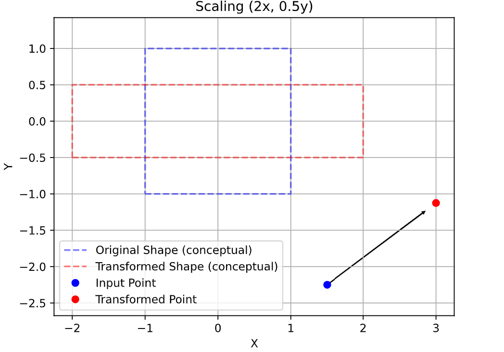
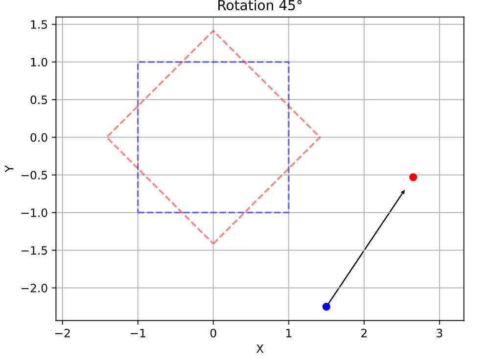

<!---

This file is used to generate your project datasheet. Please fill in the information below and delete any unused
sections.

The peripheral index is the number TinyQV will use to select your peripheral.  You will pick a free
slot when raising the pull request against the main TinyQV repository, and can fill this in then.  You
also need to set this value as the PERIPHERAL_NUM in your test script.

You can also include images in this folder and reference them in the markdown. Each image must be less than
512 kb in size, and the combined size of all images must be less than 1 MB.
-->

# Affinex - Affine Transformation Accelerator

Author: Adam Gebregziaber

Peripheral index: 39

## What it does

An affine transformation is a geometric transformation that combines linear transformation operations like rotation, scaling, shearing or reflection. These transformations are widely used in areas like computer graphics and image processing.

The project implements a 2D affine transformation accelerator which is designed to perform these operations in hardware using Q8.16 fixed point arithmetic.


Affine transformation in 2D can be expressed as:
<div align="center">

<tr>
<td></td>
</tr>

</div>


Equation:
 

                                                        x' = a * x + b * y + tx
                                                        y' = d * x + e * y + ty


                                                        Input Point (x, y)
                                                                |
                                                                v
                                                            [ a  b ]
                                                            [ d  e ]  (2D transformation matrix)
                                                                |
                                                                |
                                                                v
                                                        Translation vector (tx, ty)
                                                                |
                                                                v
                                                        Output Point (x', y')


## Register map


| Address | Name       | Access | Description           |
|---------|------------|--------|-----------------------|
| 0x00    | CONTROL    | W      | Start operation       |
| 0x04    | STATUS     | R      | Status                |
| 0x08    | A          | W      | Coeffient a           |
| 0x0C    | B          | W      | Coeffient b           |
| 0x10    | D          | W      | Coeffient d           |
| 0x14    | E          | W      | Coeffient e           |
| 0x18    | TX         | W      | translation offset tx |
| 0x1C    | TY         | W      | translation offset ty |
| 0x20    | XIN        | W      | input X               |
| 0x24    | YIN        | W      | input Y               |
| 0x28    | XOUT       | R      | output X              |
| 0x2C    | YOUT       | R      | output Y              |

</div>

## How to test

The following test cases demonstrate common affine operations.


| Transformation | a  | b   | d   | e  | tx   | ty   | Input (x, y) | Expected Output (x’, y’) |
| -------------- | -- | --- | --- | -- | ---- | ---- | ------------ | ------------------------ |
| Scale ×2       | 2  | 0   | 0   | 2  | 0    | 0    | (1.5, -2.25) | (3.0, -4.5)              |
| Rotate 90°     | 0  | -1  | 1   | 0  | 0    | 0    | (1.5, -2.25) | (2.25, 1.5)              |
| ReflectX       | -1 | 0   | 0   | 1  | 0    | 0    | (1.5, -2.25) | (-1.5, -2.25)            |
| ReflectY       | 1  | 0   | 0   | -1 | 0    | 0    | (1.5, -2.25) | (1.5, 2.25)              |
| Shear XY       | 1  | 0.5 | 0.5 | 1  | 0    | 0    | (1.5, -2.25) | (0.375, 0.75)            |


</div>

## Conceptual Diagrams

To help visualize the transformations, a conceptual square shape is plotted alongside the single input point. These diagrams are **for documentation purposes** and the hardware in this project operates on **one point at a time only**.

<div align="center">
<table>
<tr>
<td></td>
<td></td>
</tr>
<tr>
<td></td>
<td></td>
</tr>
</table>
</div>


## Example Usage

1. Configure a 45° rotation:

```text
A = 0.707, B = -0.707
D = 0.707, E =  0.707
TX = 0,    TY = 0

```

2. Write input point: x = 10.0 and y' = 0.0
3. Read output:       x' = 7.07 and y' = 7.07


## Reference 

- [Affine Transformations in Computer Graphics (Wikipedia)](https://en.wikipedia.org/wiki/Transformation_matrix#Affine_transformations)

- [Affine Transformation algorithm](https://www.algorithm-archive.org/contents/affine_transformations/affine_transformations.html)
