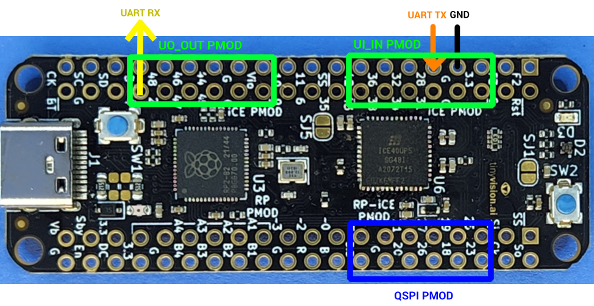

# Running TinyQV on Pico-ICE FPGA

There's no substitute for testing your design on FPGA.  The pico-ice board allows testing in a very similar setup to the Tiny Tapeout demo board, using the on board RP2040 on the pico-ice.

There are a couple of caveats to testing on pico-ice:
- The FPGA is quite slow, so the clock speed is set to 14MHz.
- The FPGA is quite small, so only one or two peripherals can be included at once.

## Hardware required

You will need:
- A [pico-ice](https://pico-ice.tinyvision.ai/) dev board
- A [QSPI pmod](https://store.tinytapeout.com/products/QSPI-Pmod-p716541602)
- Something that can talk UART - I use a [Raspberry Pi debug probe](https://www.raspberrypi.com/documentation/microcontrollers/debug-probe.html)

## Hardware Setup

- Flash [pico-ice micropython](https://github.com/tinyvision-ai-inc/pico-ice-micropython/releases) to the pico-ice.
- Put the QSPI Pmod in the shared Pmod socket (the bottom right one if you view the board with the USB connection at the left).
- Connect the probe's UART RX to the pin labelled 4 (out0 on the top left Pmod), and the probe's UART TX to the pin labelled 28 (in7 on the top right Pmod), and connect to a ground.

## Software Setup

- Install [oss-cad-suite](https://github.com/YosysHQ/oss-cad-suite-build) and put it on your path
- Make a venv and `pip install mpremote`

## Building TinyQV

The competition version of TinyQV with all the peripherals enabled is much too large for the ICE40 UP5k FPGA on the pico-ice.  You will need to edit the `peripherals.v` file in this directory and enable only the peripheral(s) that you want to test.  Leave all the other slots set to `tqvp_full_empty` or `tqvp_byte_empty` as appropriate.

To build:

    make

To program the TinyQV gateware to the FPGA flash:

    make burn

## Using TinyQV

To run a TinyQV program, copy your program file (e.g. `my_program.bin`) into the `micropython` subdirectory, and then:

    PROG=my_program make run

To reset TinyQV without reprogramming the flash:

    make reset

To create programs, see the [tinyQV SDK](https://github.com/MichaelBell/tinyQV-sdk/tree/ttsky25a) and [example projects](https://github.com/MichaelBell/tinyQV-projects).

A hello program, that prints a few lines to UART, and a compatible version of micropython can be found in the micropython directory.

To run Micropython:

    PROG=tqv-micropython make run
